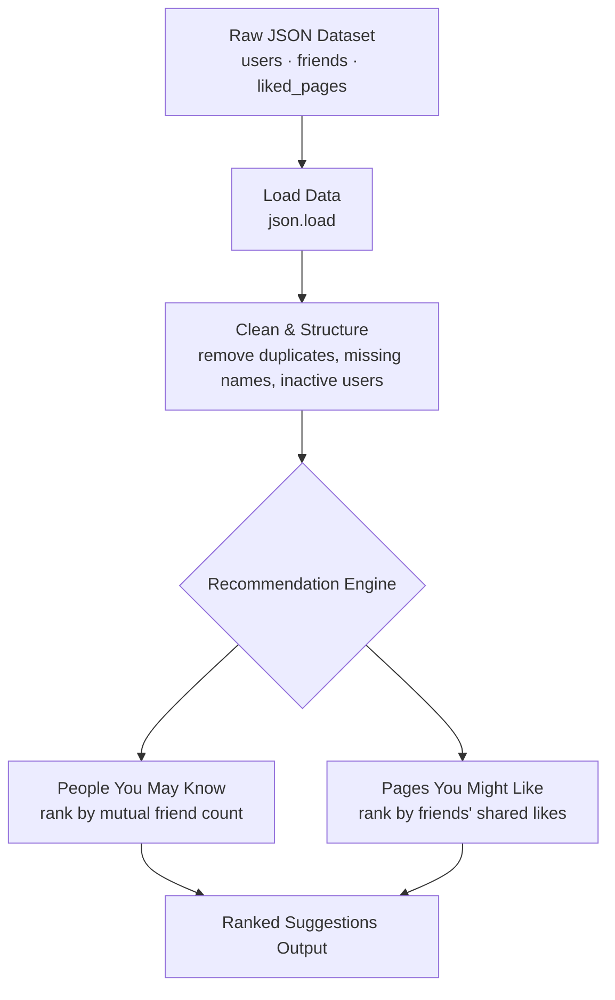

# 🐍 CodeBook — Social Network Analysis in Pure Python (No Pandas, No NumPy)

**Coders of Delhi Challenge:** Build a social-network recommendation engine — friend suggestions ("People You May Know") and content suggestions ("Pages You Might Like") — using **nothing but core Python**: no Pandas, no NumPy, no external libraries. Just `dict`, `set`, `list`, and algorithmic thinking.

<p align="left">
  
  
  
  
  
  
</p>

> 🔑 **Keywords:** Pure Python Project, Social Network Analysis Python, Friend Recommendation Algorithm, People You May Know Algorithm, Mutual Friends Python, Content Recommendation System, JSON Data Processing Python, Python Without Libraries, Data Structures and Algorithms Python, Coders of Delhi

---

## 📌 Table of Contents

1. [Overview](#-overview)
2. [The Challenge](#-the-challenge)
3. [Project Index](#-project-index)
4. [How It Works — Algorithm Flow](#-how-it-works--algorithm-flow)
5. [Dataset](#-dataset)
6. [Sample Output](#-sample-output)
7. [Getting Started](#-getting-started)
8. [Key Skills Demonstrated](#-key-skills-demonstrated)
9. [Why Pure Python?](#-why-pure-python)
10. [About Me](#-about-me)

---

## 🧭 Overview

**CodeBook** is a fictional "social media for coders," and this project simulates its backend recommendation logic from scratch. Given a dataset of users, their friendships, and the pages they've liked, the code answers two real, production-relevant questions:

- 🤝 **Who should this user be friends with?** (mutual-connections-based suggestions)
- 📄 **What pages might this user like?** (shared-interest-based content suggestions)

The twist: everything is built using only Python's built-in data structures — `dict`, `set`, `list` — deliberately avoiding Pandas/NumPy to prove the underlying logic can be implemented with fundamentals alone.

## 🎯 The Challenge

> *This Delhi-based company, CodeBook, needs its data analyzed and its recommendation features built — using only core Python.*

Rules of the challenge:
- ❌ No Pandas
- ❌ No NumPy
- ❌ No external/third-party libraries
- ✅ Only Python's standard library (`json`, `dict`, `set`, `list`, comprehensions)

## 📚 Project Index

| # | Notebook | What It Does |
|---|---|---|
| 01 | [`01_introduction.ipynb`](./codersofdelhi/01_introduction.ipynb) | Loads the raw user/page JSON dataset and displays each user with their friends and liked pages |
| 02 | [`02_cleaning_and_structuring_the_data.ipynb`](./codersofdelhi/02_cleaning_and_structuring_the_data.ipynb) | Cleans messy data — removes users with missing names, de-duplicates friend lists, drops inactive users — and writes a clean dataset |
| 03 | [`03_people_you_may_know.ipynb`](./codersofdelhi/03_people_you_may_know.ipynb) | Builds a **mutual-friends recommendation engine**: suggests new connections ranked by number of shared friends |
| 04 | [`04_pages_you_might_like.ipynb`](./codersofdelhi/04_pages_you_might_like.ipynb) | Builds a **content recommendation engine**: suggests pages based on what a user's friends have liked |

## ⚙️ How It Works — Algorithm Flow



**People You May Know — logic:**
1. For the target user, collect their direct friends.
2. For every friend-of-a-friend who *isn't already a direct friend*, count how many mutual friends they share with the target user.
3. Rank and return suggestions by mutual-friend count (highest first).

**Pages You Might Like — logic:**
1. Look at the pages the target user's friends have liked.
2. Exclude pages the user already likes.
3. Rank remaining pages by how many friends liked them.

## 🗃️ Dataset

Simulated JSON datasets representing the CodeBook social graph:

| File | Purpose |
|---|---|
| [`data.json`](./codersofdelhi/data.json) | Small starter dataset for the intro notebook |
| [`data1.json`](./codersofdelhi/data1.json) | Slightly larger raw dataset used for the cleaning step |
| [`cleaned_codebook_data.json`](./codersofdelhi/cleaned_codebook_data.json) | Output of the cleaning notebook — de-duplicated, validated data |
| [`massive_data.json`](./codersofdelhi/massive_data.json) | Larger simulated dataset (30 users, 27 pages) used to test both recommendation engines at scale |

Each user record looks like:
```json
{
  "id": 1,
  "name": "Amit",
  "friends": [2, 3, 5],
  "liked_pages": [101, 102]
}
```

## 🖥️ Sample Output

```text
People You May Know for User 3: [7, 12, 19]
Pages You Might Like for User 1: [104, 108, 110]
```

## 🚀 Getting Started

```bash
# 1. Clone the repository
git clone https://github.com/<your-username>/<your-repo>.git
cd codersofdelhi

# 2. No installation needed — pure Python standard library only!
python3 --version   # Python 3.x is all you need

# 3. Run any notebook with Jupyter, or execute the logic directly
jupyter notebook 03_people_you_may_know.ipynb
```

No `pip install` required — that's the entire point. 🎉

## 🎯 Key Skills Demonstrated

`Core Python` · `Data Structures (Dictionaries, Sets, Lists)` · `JSON Parsing` · `Data Cleaning Without Libraries` · `Algorithm Design` · `Graph-style Mutual Connections Logic` · `Recommendation Systems Fundamentals` · `Problem Decomposition`

## 💡 Why Pure Python?

Libraries like Pandas and NumPy are powerful, but leaning on them can hide whether you actually understand the underlying logic. This challenge strips that away — every recommendation is computed with plain loops, dictionaries, and sets, proving the algorithmic thinking behind features like "People You May Know" that power real platforms like Facebook and LinkedIn.

## 👤 About Me

Part of the **Coders of Delhi** community challenge series — solving real-world-style problems with fundamentals-first Python.

- 🔗 [GitHub](https://github.com/rohi56)
- 🔗 [LinkedIn](https://linkedin.com/in/rohi56)

---

⭐ *If this helped you understand recommendation algorithms without needing a library, consider starring the repo!*
